# 이력서

[Github](https://github.com/LucasDev86)

[NaverBlog](http://blog.naver.com/PostList.nhn?blogId=juseyo86)

## 경력

[제주항공] 대리(https://www.jejuair.net/)
- 2019/06 ~ 2020/11

[한일네트웍스] 대리(http://http://www.hanilnetworks.com/)
- 2018/05 ~ 2019/06

[한미헬스케어] 사원(http://www.hanmihealthcare.co.kr/)
- 2017/04 ~ 2018/04

[테이블엔조이] 주임(http://www.tablenjoy.com/)
- 2015/12 ~ 2017/03

## 인턴

[인아오리엔탈모터] 인턴(http://www.inaom.co.kr/)
- 2014/10/ ~ 2015/02

## 군경력
60사단 포병연대 551대대 예비역간부 비상근 복무
- 2019/01 ~ 현재

육군 통신장교 [53사단]
- 2011/10 ~ 2013/09
 * 격오지 해안대대 근무
 
육군 통신부사관 [12사단]
- 2007/02 ~ 2011/09
 * GOP 1년근무
 
## 교육수료
### 교육기관 : (주)중앙HTA
- 차세대 UIUX 멀티플랫폼 전문가 과정
- 2014/03 ~ 2014/08
- 교육내용 : JAVA, ANDROID, DATABASE

### 교육기관 : 패스트캠퍼스
- ios 스위프트 초급자 교육
- 2017/02 ~ 2017/04
- 교육내용 : Swift 언어 기초, Swift 간단한 앱 개발

### 교육기관 : 세민직업전문학교
- Kotlin 프로그래밍
- 2019/5 ~ 2019/7
- 교육내용 : Kotlin 언어 기초, Android 앱 개발

### 교육기관 : 더조은아카데미
- Swift프로그래밍
- 2019/11 ~ 2020/12
- 교육내용 : Swift 언어 기초, ios 앱 개발

### 교육기관 : 패스트캠퍼스
- Android 리액티브 RxJava
- 2020/05 ~ 2020/07
- 교육내용 : Android RxJava 중급

## 프로젝트

### 제주항공
- 소속 : 제주항공
- 역할 : Android , iOS 개발
- 기간 : 2019/06 ~ 2020/11
- 사용기술 : Java, swift ,kotlin, RxJava, MVP, OCR 여권스캔
- 크래시 오류율 0.5미만유지, 중국 텐센트, 360마켓 사용
- [AppStore](https://play.google.com/store/apps/details?id=com.parksmt.jejuair.android16&hl=ko)

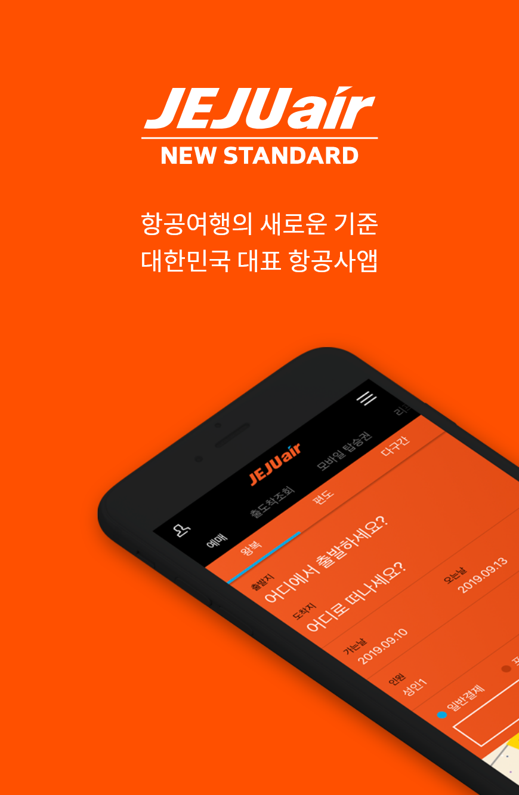 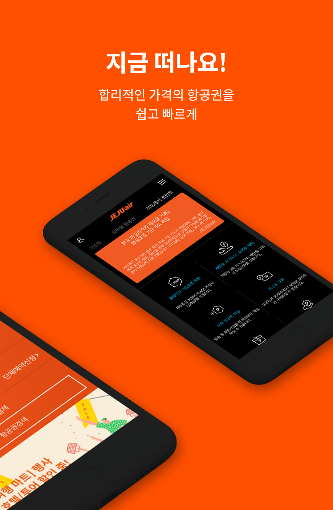   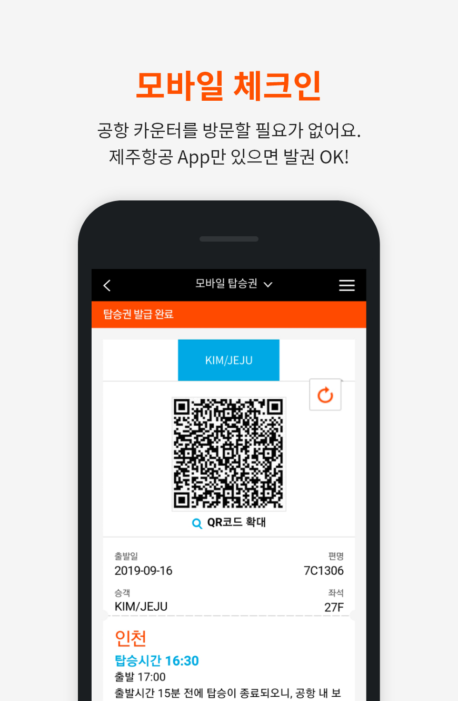

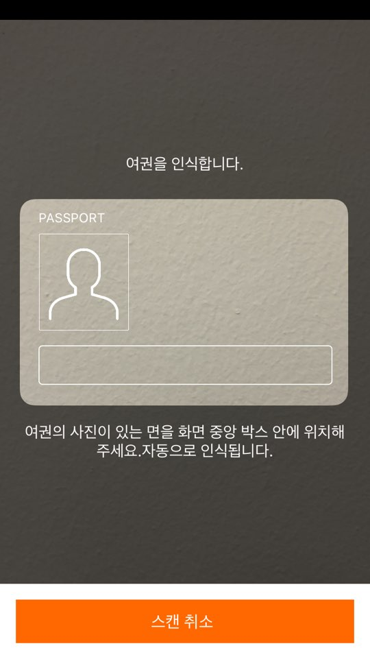 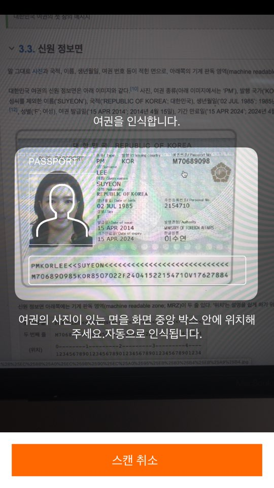

### 여행119
여행자보험 가입플랫폼
- 소속 : 한일네트웍스
- 역할 : Android 앱 개발
- 기간 : 2018/05 ~ 2019/06
- 사용기술 : kotlin, RxJava, MVP, MVVM, LG U+, SNS(카카오톡, 페이스북)연동
- [AppStore](https://play.google.com/store/apps/details?id=com.hanil.travel)

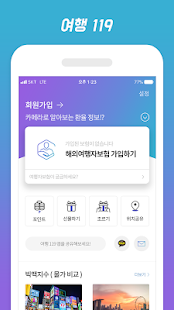   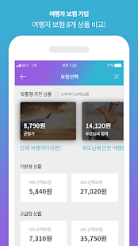   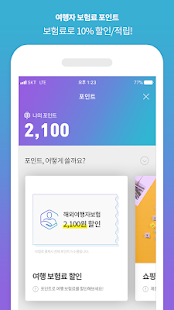
    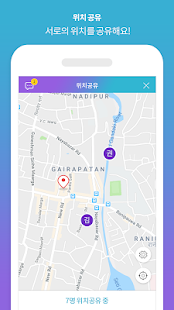  

### 블랙박스
상담챗봇(감정점수 그래프 표현)
- 소속 : 한일네트웍스
- 역할 : Android 앱 개발
- 기간 : 2018/05 ~ 2019/06
- 사용기술 : Java, Stt(구글), TTs(셀바스), 구글차트

 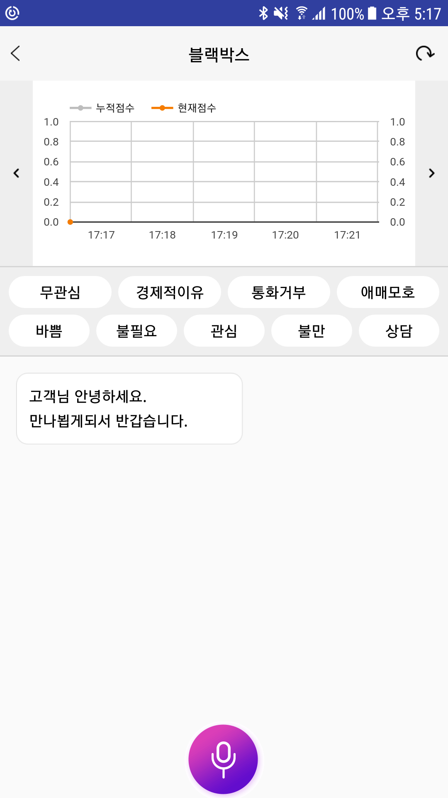   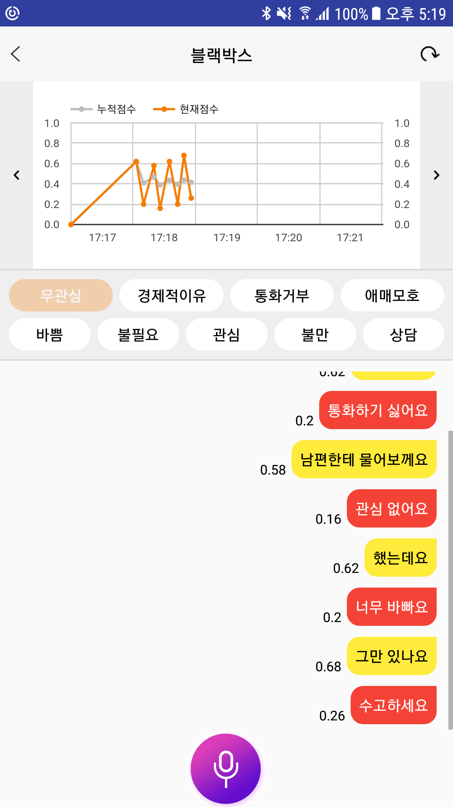  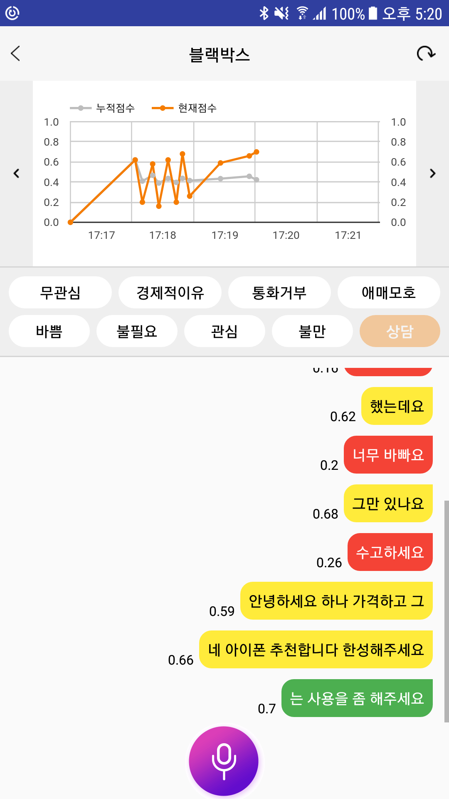  

### 한미
## 한미약품 영업관리앱 
  - 주요기능 : 거래처관리 / GPS 기반 업무처리
  - 개발환경 : 안드로이드
  - 2018 식음료 지원 지출보고서 개발(보건복지부 시연)
## 온라인팜 영업관리 App 
  - 주요기능 : 주문 / 수금 / KSNET 결제시스템 
  - 개발환경 : 안드로이드
  - 매출할인 프로그램 개발
## 메디케어 영업관리 App
  - 주요기능 : 주문 / 수금 / 영업 전반 관리
  - 개발환경 : 앵귤러.js / 아이오닉 / 스프링 api / 코도바
  - 메디케어 영업사원이 사용하는 하이브리드 앱 유지보수 담당
## 한미톡 한미약품 그룹사 채팅앱 
- 소속 : 한미IT
- 역할 : Android 앱 개발
- 기간 : 2017/04 ~ 2018/04

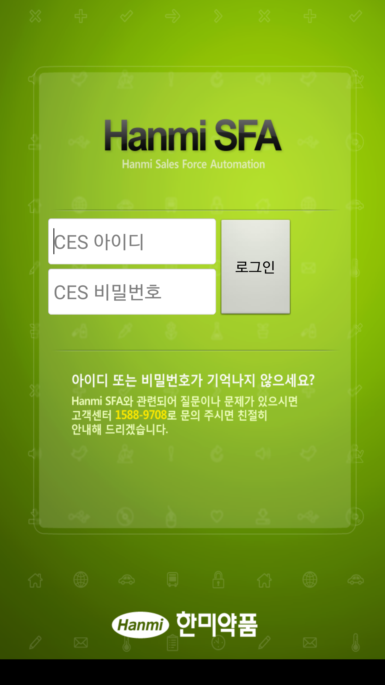   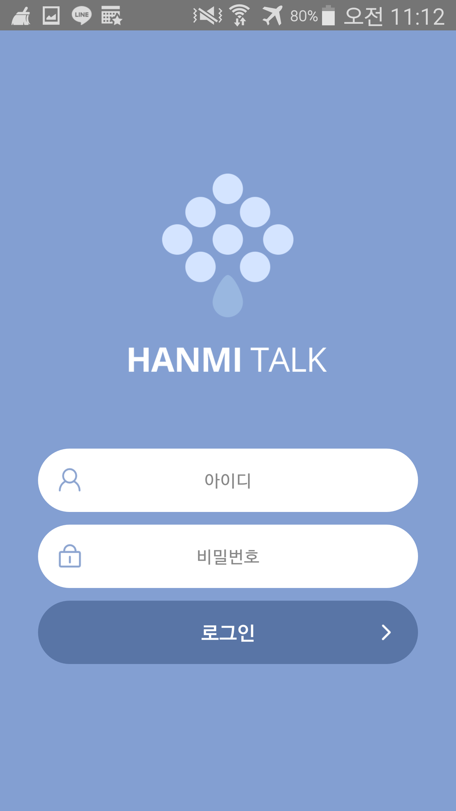

### 테이블엔조이
레스토랑 구매 & 예약 시스템
- 소속 : 테이블엔조이
- 역할 : Android 앱 개발
- 기간 : 2016/03 ~ 현재
- 사용기술 : JAVA, RxJava, MVP, 이니시스 결재, SNS(카카오톡, 페이스북)연동
- [AppStore](https://play.google.com/store/apps/details?id=com.tablenjoy&hl=ko)

       
      

### 레스토랑엔조이
레스토랑 구매 & 예약 시스템
- 기간 : 2015/12 ~ 2016/03
- 소속 : 테이블엔조이
- 역할 : Android
- 사용기술 : Android, API(PHP)
- (새로 리뉴얼됨)

       

### 인아오리엔탈모터 사이트
사이트 및 서버 유지보수, 영업관리 APP 작업
- 기간 : 2014/10 ~ 2015/02
- 소속 : 인아그룹
- 역할 : 사이트 및 서버관리, Android
- 사용기술 : JSP, Android, RESIN서버, MS-SQL
- [그룹웨어](http://intra.inaom.co.kr/)
- [사이트](https://www.inaom.co.kr/)

 

